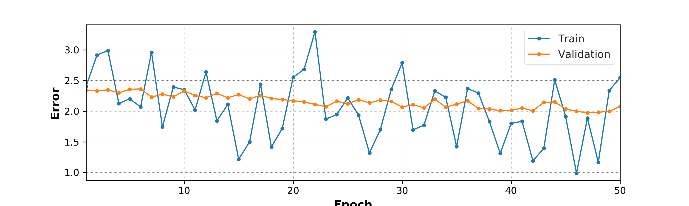
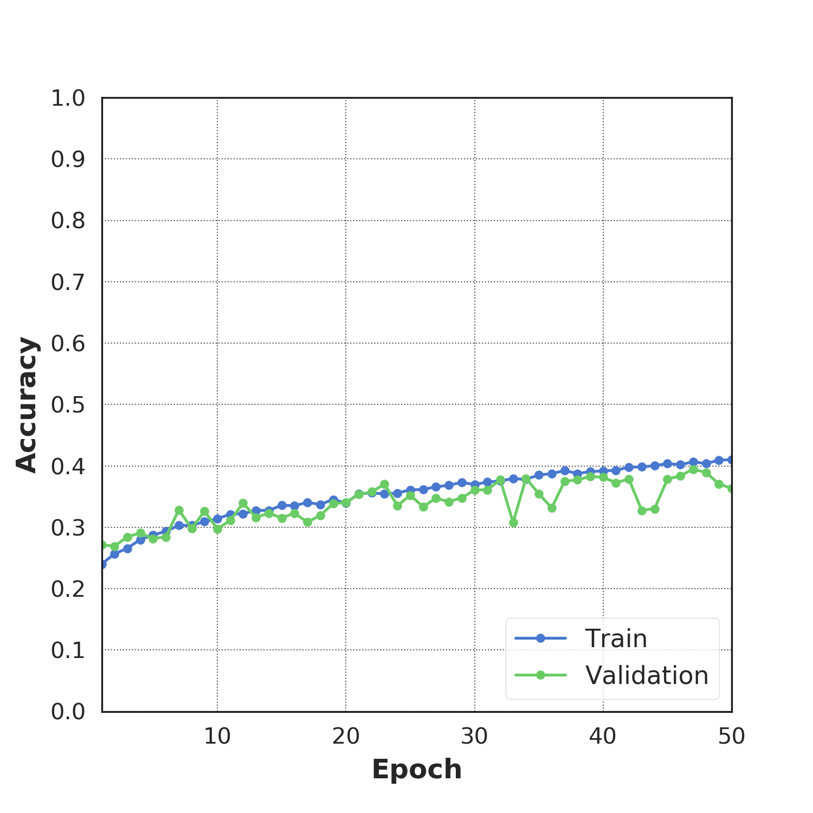

# Brightside

Python library for plotting common plots and formatting text and tables in Jupyter Notebook.

## Examples

Loading the libraries:


```bash
%matplotlib inline

import brightside as bs
import matplotlib
from matplotlib import pyplot as plt
import numpy as np
```

### Loss and Accuracy plots

Loading the log data into numpy arrays.

```python
epochs, train_loss, train_acc, val_loss, val_acc = np.loadtxt('training.log', delimiter=' ', 
                                                              usecols=(1, 3, 5, 7, 9), unpack=True)
labels = ['Train', 'Validation']
```

Plotting the loss

```python
fig, ax = bs.plot_loss([train_loss,val_loss], labels, epochs=epochs, figsize=(10,3))
plt.savefig('loss_plot.png', format='png', dpi=300)
```
<center></img></center>

Plotting the accuracy

```python
fig, ax = bs.plot_accuracy([train_acc,val_acc], labels, epochs=epochs, figsize=(5,5))
plt.savefig('acc_plot.png', format='png', dpi=300)
```
<center></img></center>

